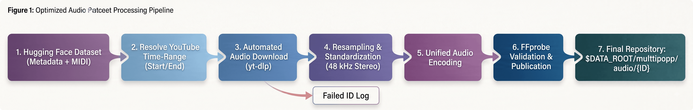

# MulTTiPop Audio Pipeline

Download the [`gclef-cmu/multtipop`](https://huggingface.co/datasets/gclef-cmu/multtipop)
snapshot and its referenced YouTube segments, apply
[FlashSR](https://github.com/jakeoneijk/FlashSR_Inference), and save 48 kHz audio
to:

```text
$DATA_ROOT/multtipop/audio/{ID}.{opus|mp3|flac}
```

The pipeline downloads only the time range specified in the metadata. It is
resumable, validates outputs before publishing them, keeps dataset files as real
files rather than symbolic links, and retries each download three times after
the initial attempt.

## Pipeline



## Requirements

- Linux, an NVIDIA GPU, and a CUDA-compatible driver
- Conda, Git, npm, and Node.js
- FFmpeg/FFprobe with Opus, MP3, and FLAC encoders
- About 3.4 GB for FlashSR checkpoints, plus dataset and audio storage

## Setup

```bash
git clone https://github.com/mimbres/multtipop-audio.git
cd multtipop-audio
bash setup_env.sh
```

The setup script creates a project-local `.venv`, installs a CUDA 12.6 PyTorch
build and the pinned FlashSR revision, and installs a local Node.js 22 runtime.
Set `CONDA_BIN` or `ENV_PREFIX` to override the detected Conda executable or
environment location.

## Run

```bash
export DATA_ROOT=/path/to/data
./run_pipeline.sh --data-root "$DATA_ROOT"
```

Opus is the default (`libopus`, 256 kbit/s VBR). MP3 uses 320 kbit/s CBR and
FLAC uses lossless 24-bit encoding:

```bash
./run_pipeline.sh --data-root "$DATA_ROOT" --format mp3
./run_pipeline.sh --data-root "$DATA_ROOT" --format flac
```

Useful options:

```text
--retries N             Retries after the initial download attempt (default: 3)
--cookies FILE          Netscape-format YouTube cookie file
--format FORMAT         opus, mp3, or flac
--id ID                 Process one ID; repeat to select multiple IDs
--limit N               Process the first N selected records
--keep-source           Keep downloaded source segments
--overwrite             Regenerate valid outputs
--skip-dataset-download Use an existing dataset snapshot
--device DEVICE         FlashSR device (default: cuda:0)
```

Rerun the same command after interruption; valid outputs are skipped. Progress
and failure details are written under `$DATA_ROOT/multtipop/logs/`:

```bash
cat "$DATA_ROOT/multtipop/logs/status.json"
tail -f "$DATA_ROOT/multtipop/logs/pipeline.log"
cat "$DATA_ROOT/multtipop/logs/failed_ids.log"
```

If YouTube requires sign-in, update `yt-dlp` and pass exported Netscape-format
cookies with `--cookies`. Never commit cookie files.

## Reference run

A completed 572-record Opus run produced 557 valid files: 555 were processed
and 2 already-valid files were skipped. The remaining 15 records failed during
download after retries. Their IDs and failure stage are tracked in
[`failed_ids.log`](failed_ids.log). YouTube availability changes over time, so
future results may differ.

## Tests

```bash
pytest -q
```

## Disclaimer

This is an unofficial repository and is not endorsed by the MulTTiPop authors
or YouTube. All music and recording rights remain with their respective owners.
Use this software only for research, comply with applicable licenses and laws,
and proceed at your own risk.

## Citation

Please cite the [MulTTiPop paper](https://arxiv.org/abs/2607.08756):

```bibtex
@article{pruyne2026multtipop,
  title={MulTTiPop: A Multitrack Transcription Dataset for Pop Music},
  author={Pruyne, Nathan and Stoler, Benjamin and Chen, William and Huang,
          Chien-yu and Watanabe, Shinji and Donahue, Chris},
  journal={arXiv preprint arXiv:2607.08756},
  year={2026}
}
```
